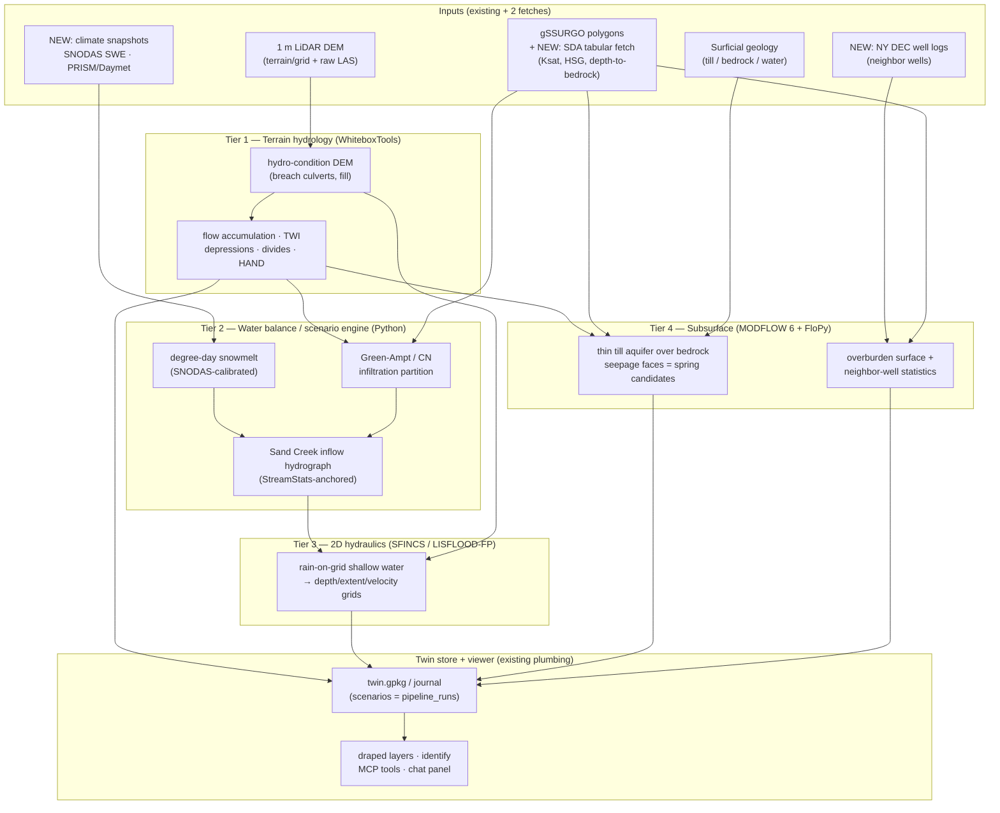
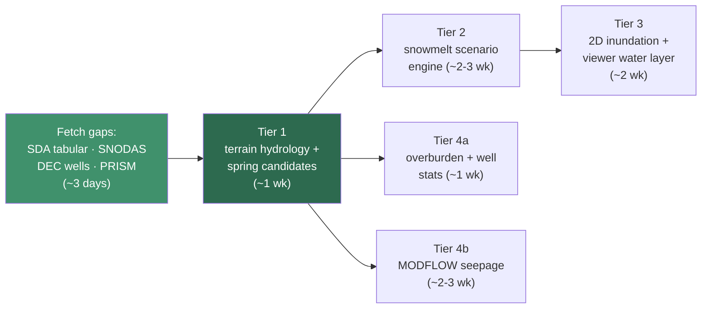

# Hydrological Simulation on a VEIL Twin — Feasibility & Roadmap

*Research report, June 2026. Reference twin: `/home/zy/dev/snow-road-twin` (141 Snow Road, Adirondack Park, NY — ~40 ac AOI, Sand Creek crossing, EPSG:26918).*

---

## 0. What the twin already has (and the two gaps that matter)

The Snow Road twin is unusually well-positioned for this. Inventory of hydrologically relevant data already on disk:

| Data | Source | Resolution / quality | Hydrologic use |
|---|---|---|---|
| Terrain grid + apron | FEMA 2017 LiDAR (0.7 m point spacing), 1 m DEM | **Excellent** — this is the gold-standard input | Flow routing, ponding, channel geometry, inundation |
| Raw LAS tiles (URLs pinned) | `gisdata.ny.gov` | ~1.2 GB, 2 tiles cover AOI+ | Re-grid hydro-conditioned DEM at full res, channel cross-sections |
| Soils polygons | gSSURGO (`NY091`) | Map-unit scale (2 units cover the AOI: Berkshire loam BHC, Berkshire-Tunbridge BLE) | Infiltration, runoff partitioning, depth-to-bedrock prior |
| Surficial geology | Hudson-Mohawk sheet | Coarse (4 features: till `t`, bedrock `r`, water) | Aquifer conceptual model, spring-contact logic |
| Hydrography | NYS hydrography / NHD | Sand Creek (perennial, ReachCode `02020002000823`), unnamed perennial trib, small pond | Channel network truth, model targets |
| Wetlands | NWI + DEC freshwater wetlands | Polygon | **Validation target** for wetness/seep predictions |
| Watersheds | HUC12 (`usgs_watershed_huc12`) | Basin context | Upstream contributing-area boundary conditions |
| Stream classifications | DEC | Reach attributes | Regulatory + ecological context |

**Gap 1 — SSURGO tabular attributes were never fetched.** `drainage_class` and `hydrologic_group` are `null` in `data/soils/`. The polygons carry only `MUKEY`. Everything quantitative about soil water (Ksat, available water capacity, depth to restrictive layer, seasonal high water table, hydrologic soil group) lives in the SSURGO *tabular* tables (`component`, `chorizon`, `corestrictions`, `muaggatt`), keyed by that same MUKEY and queryable with one T-SQL POST to [USDA Soil Data Access](https://www.nrcs.usda.gov/resources/data-and-reports/soil-survey-geographic-database-ssurgo). This is a half-day script (`fetch_ssurgo_tabular.py` in the us-national pack) and it unlocks most of Tier 2 below. For context the soil series themselves are informative: Berkshire is a deep, well-drained loamy spodosol formed in glacial till; Tunbridge is the *moderately deep to bedrock* (50–100 cm) member of the complex — i.e., the BLE polygon is where shallow bedrock forces water laterally. (Verify against the fetched tabular data, don't trust my series memory.)

**Gap 2 — no climate/snow forcing.** Simulation needs weather in, water out. All free, all API-snapshot-able in the existing atlas pattern:
- [SNODAS](https://nsidc.org/data/g02158/versions/1) — daily 1 km snow water equivalent + snowmelt grids, CONUS, 2003–present ([GEE mirror](https://gee-community-catalog.org/projects/snodas/)). The property is ~1 pixel; the upstream Sand Creek basin is a handful.
- PRISM or Daymet — daily precip/temp normals and time series at 800 m / 1 km.
- Nearby NWS/NYSM station data for calibration (Glens Falls, North Creek mesonet).

---

## A. What can we *actually* simulate, and at what fidelity

Honest assessment, ordered from most to least defensible. The pattern throughout: **the terrain side is extremely strong (1 m LiDAR), the subsurface side is weak (2 soil polygons, no boreholes), so fidelity decays with depth below the ground surface.**

### A1. Where water flows, concentrates, and ponds — HIGH fidelity ✅

Pure terrain analysis on the 1 m DEM: flow direction/accumulation, upslope contributing area per pixel, depression (ponding) extent and spill points, drainage divides, downhill flow path from any clicked point, channel cross-sections. This is deterministic, runs in seconds with [WhiteboxTools](https://www.whiteboxgeo.com/manual/wbt_book/available_tools/hydrological_analysis.html) or [pysheds](https://sites.psu.edu/mapsgislib/2021/04/12/stream-extraction-using-whiteboxtools/), and at 1 m resolution is *quantitatively* credible — it will resolve individual ditches, culvert backups, and the micro-drainages LiDAR sees under canopy. The known failure mode is road/driveway embankments acting as false dams (real culverts must be "breached" into the DEM — a one-time manual step worth doing carefully).

### A2. Relative wetness & seep/spring candidate mapping — MODERATE fidelity, honestly framed as *ranking* ✅

The [Topographic Wetness Index](https://agupubs.onlinelibrary.wiley.com/doi/full/10.1029/2021WR029871) (TWI = ln(contributing area / tan slope)) and its descendants predict *relative* soil moisture; landscape position alone explained ~52 % of groundwater-pattern variance in field studies. The state of the art for spring prediction is exactly the data we have: a 2022 remote-sensing study using **LiDAR topographic variables + limited geologic data in a MaxEnt model located real groundwater discharge (seeps and springs) correctly in ~93 % of field-verified cases** ([Remote Sensing 14(1):63](https://www.mdpi.com/2072-4292/14/1/63)). The physical logic ports directly to this site: hillslope seeps form where flow converges, slope breaks, and a permeability contrast forces water out — here, the till/bedrock contact (Tunbridge map unit + surficial `r`/`t` boundary) and the toe-of-slope positions above Sand Creek.

What's defensible: a **draped "seep/spring likelihood" layer** (TWI percentile × slope-break × shallow-bedrock proximity), validated against the NWI wetlands and the mapped pond — *"these 6 spots are where springs should be; go look."* What's not defensible: "a spring discharging X gpm will appear at this pixel under Y conditions." That requires field confirmation as training data — which the Survey companion (QField `observations`/`photo_points` layers) is literally built to collect, closing the loop.

### A3. Snowmelt → creek behavior (Sand Creek scenarios) — MODERATE for hydrology, HIGH for the geometry ✅⚠️

Two separable problems:

1. **How much water arrives, and when** (hydrology) — MODERATE. A degree-day (temperature-index) snowmelt model driven by SWE is the standard for this scale and "works well enough in hydrological models" per the [snowmelt model literature](https://www.mdpi.com/2071-1050/13/20/11485); energy-balance models ([UEB](https://hydrology.usu.edu/dtarb/snow/snowrep.pdf), iSnobal) buy accuracy mainly when you have radiation/wind data, which we don't. SNODAS SWE itself needs bias-checking — used raw it [over-estimates peak-flow magnitude and shifts timing](https://www.tandfonline.com/doi/full/10.1080/02626667.2019.1660780) in eastern basins. The big caveat: Sand Creek's flow is set by its *upstream* basin (delineated from the apron DEM + HUC12, likely a few km²), which is ungauged. [USGS StreamStats for NY](https://www.usgs.gov/streamstats/new-york-streamstats) gives regression peak flows (2/10/100-yr) as an anchor, but [USGS itself warns](https://www.usgs.gov/streamstats/what-smallest-drainage-area-streamstats-can-delineate-accurately-and-can-i-rely-flow) errors are large for small basins. So: a **scenario engine** ("given 8″ of SWE and a 3-day 50 °F thaw with rain, Sand Creek peaks near X cfs over Y hours"), with ±50 %-class uncertainty on discharge — useful for planning, not forecasting.

2. **Where that water goes on the property** (hydraulics) — HIGH, geometrically. Given an inflow hydrograph, a 2D shallow-water "rain-on-grid" model on the LiDAR DEM maps inundation extent, depth, and velocity at meter scale. The tooling is mature and free: HEC-RAS 2D rain-on-grid, [LISFLOOD-FP](https://www.tandfonline.com/doi/full/10.1080/02626667.2019.1671982) (raster-native, [robust even in data-scarce small watersheds](https://www.mdpi.com/2073-4441/14/5/748)), or Deltares' SFINCS (reduced-physics, very fast, built for exactly this scenario-sweep use). Comparative studies show [LiDAR-derived grids at 1–25 m give the best results](https://www.researchgate.net/publication/336595561_Comparing_2D_capabilities_of_HEC-RAS_and_LISFLOOD-FP_on_complex_topography), and our domain (670 × 884 m) is tiny — full 1 m runs take minutes. Flood-extent *shape* will be very good; absolute depth inherits the inflow uncertainty from (1).

### A4. Infiltration / absorption — LOW-to-MODERATE, scenario-level only ⚠️

With SSURGO tabular fetched we get Ksat, hydrologic soil group, and water-table depth — but at *map-unit* scale: the whole property is two polygons of "very bouldery" till, which is exactly the soil whose point-scale conductivity varies by orders of magnitude. Gridded products help interpolate: [POLARIS](https://agupubs.onlinelibrary.wiley.com/doi/full/10.1029/2018WR022797) (30 m probabilistic Ksat, water-retention parameters) and NRCS [SOLUS100](https://catalog.data.gov/dataset/soil-landscapes-of-the-united-states-100-meter-solus100-soil-property-maps) (100 m, includes `anylithicdpt` depth-to-bedrock). Defensible outputs: runoff-vs-soak partitioning per storm scenario (Green-Ampt or SCS curve number), comparative statements ("the BLE slope sheds ~3× more of a 2″ storm than the bench"), and antecedent-condition sensitivity. Not defensible: "this spot absorbs N inches/hour."

### A5. Depth to drill for water — NOT a simulation; a data + statistics problem ❌→📊

This one needs reframing. The site is glacial till over fractured crystalline bedrock (Adirondack basement). Well yield in fractured crystalline rock is controlled by which fractures the bore happens to hit — effectively stochastic at point scale; no physics model with our data (or frankly anyone's surface data) predicts it. The honest, genuinely useful product instead:

- **Overburden thickness surface** — LiDAR ground surface minus a bedrock surface interpolated from SSURGO/SOLUS depth-to-restriction, surficial-geology `r` outcrops (depth = 0 there), and nearby well logs. Tells you casing depth, which is real money.
- **Neighbor-well statistics** — NY DEC has [80,000+ water well completion reports online](https://www.nywelldriller.org/news/dec-water-well-completion-reports/) ([program page](https://dec.ny.gov/environmental-protection/water/water-quantity/water-well-contractor-program)) recording depth to bedrock, total depth, static water level, and stabilized yield. Pull every well within a few km and report the empirical distribution: *"12 nearby bedrock wells: median 285 ft, median 6 gpm, 80 % hit water by 400 ft."* That's the real answer a driller would give, with data behind it.
- **Siting ranking** — the [USGS New Hampshire fractured-bedrock study](https://www.academia.edu/69532507/Factors_related_to_well_yield_in_the_fractured_bedrock_aquifer_of_New_Hampshire) (the reference statistical treatment for this exact geologic setting) found yield correlates with topographic position (valleys > hilltops), proximity to mapped lineaments, and lithology. We can compute those factors from data we have and rank candidate drill sites — a prior, not a prediction.

### Fidelity summary

| Question | Verdict | Fidelity of the honest product |
|---|---|---|
| Where does water flow / pond / concentrate? | ✅ Simulate | High — quantitative at 1 m |
| Where should springs/seeps form? | ✅ Rank | Moderate — calibrated candidate map, field-verifiable via Survey companion |
| Sand Creek during snowmelt, given snow totals? | ✅ Scenario-simulate | High geometry, ±50 %-class discharge |
| How much water soaks in where? | ⚠️ Scenario only | Low-moderate — relative/comparative |
| Estimate where springs flow at X gpm | ❌ | Needs field observations first |
| Depth to drill for water | 📊 Estimate, don't simulate | Overburden depth: decent. Yield: empirical neighbor distribution only |
| Forecast an actual future flood | ❌ | That's the National Water Model's job, not a twin's |

---

## B. How we'd do it

### Architecture: four tiers, each independently shippable

Each tier follows the existing VEIL grammar: a pipeline script writes to the twin store under a `pipeline_run`, results export as atlas-style draped layers + JSON payloads, MCP gets thin query wrappers, the viewer drapes and identifies. Scenarios are first-class store citizens — a scenario is a `pipeline_run` with parameter observations, so "compare the 6-inch and 12-inch SWE melt" is a temporal query like `canopy-history` already is.

### Tier 1 — Terrain hydrology layers (≈ a week; zero new theory)

`scripts/analyze_hydrology.py`, mirroring `analyze_vegetation.py`'s shape. [WhiteboxTools](https://www.whiteboxgeo.com/manual/wbt_book/intro.html) (single static binary, fits the no-server ethos; pysheds as the pip-only fallback) over the terrain grid (re-gridded from the LAS tiles at 1 m for the AOI):

1. **Hydro-conditioning**: `BreachDepressionsLeastCost` + manual culvert breach lines (a small hand-maintained `hydrology/culverts.geojson` — the one piece of field truth this tier needs).
2. **Derivatives**: D-infinity flow accumulation, TWI, slope, depression storage (fill-difference = ponding map with spill elevations), drainage-divide delineation, HAND (height above nearest drainage), downslope flow paths.
3. **Outputs**: each becomes a colored raster + value grid via the existing `add_layer.py` path → draped, clickable ("identify" on a pixel returns contributing area in acres, TWI percentile, ponding depth). A `flow_path_from(point)` query belongs in `twin_query.py` → MCP tool → the chat panel can answer *"if I dump water here, where does it go?"* by raycast + trace.
4. **Validation gate**: extracted channel network must overlay the mapped Sand Creek + trib; depressions must capture the pond. If not, fix conditioning before building anything on top.

**Spring-candidate layer** (the A2 product) is a Tier-1 deliverable too: TWI × slope-break × distance-to-(`r`/`t` contact ∪ Tunbridge unit), thresholded into ranked candidate polygons, styled like an atlas layer, validated against NWI wetlands. Field-check via QField `observations` → ingest → the candidates that get confirmed become MaxEnt training data later if we want the ML upgrade ([per the 93 % study](https://www.mdpi.com/2072-4292/14/1/63)).

### Tier 2 — Snowmelt & runoff scenario engine (≈ 2–3 weeks)

`scripts/hydro_scenario.py --swe-in 10 --melt-days 4 --rain-in 1.5 --antecedent wet`:

- **Upstream basin**: delineate Sand Creek's contributing area from the apron DEM + 3DEP (one-time, joins HUC12 context).
- **Snowmelt**: degree-day with melt factor calibrated against ~20 years of SNODAS melt grids over the basin (download once, snapshot in atlas).
- **Infiltration partition**: Green-Ampt with SSURGO/POLARIS parameters per map unit, frozen-ground modifier (the dominant control on big snowmelt-runoff events — see [HEC-HMS rain-on-snow guidance](https://www.hec.usace.army.mil/confluence/hmsdocs/hmsguides/modeling-snowmelt-in-hec-hms/modeling-rain-on-snow-events)).
- **Routing to a hydrograph**: simple time-area or unit hydrograph from the Tier-1 flow lengths — at a few km² this is fine; SWAT/PRMS would be overkill and need calibration data we don't have.
- **Anchor**: StreamStats NY regression peaks bound the credible range; flag any scenario producing flows outside the 500-yr envelope.
- **Store**: scenario parameters + summary results as observations under the run; the hydrograph JSON as a registered file. Scenarios become comparable/queryable history, same pattern as `canopy-history`.

### Tier 3 — 2D inundation (≈ 2 weeks, mostly plumbing)

Feed the Tier-2 hydrograph (upstream boundary) + direct melt/rain (rain-on-grid) into **SFINCS** (Deltares, open-source, Python-wrapped via `hydromt-sfincs`, built for fast scenario sweeps — first choice) or **LISFLOOD-FP** (simpler raster I/O, [proven on small data-scarce catchments](https://www.mdpi.com/2073-4441/14/5/748)). Domain 670 × 884 m at 1–2 m: minutes per run on a laptop. Outputs — max-depth, max-velocity, arrival-time grids — go through `add_layer.py` unchanged. The killer viewer feature is nearly free: depth grid + the existing terrain mesh → animated translucent water surface in Three.js, a "flood this scenario" toggle next to "Surrounding area." Identify on a flooded pixel reports depth/velocity/arrival with the scenario's provenance.

### Tier 4 — Subsurface (≈ 3–4 weeks, and honest about limits)

Two parallel products:

- **Water-table / seepage model**: MODFLOW 6 ([NWT-style water-table formulation](https://www.usgs.gov/publications/estimation-water-table-position-unconfined-aquifers-modflow-6)) via [FloPy](https://flopy.readthedocs.io/en/3.3.5/_notebooks/tutorial01_mf6.html) — or the purpose-built [HydroModPy](https://egusphere.copernicus.org/preprints/2025/egusphere-2024-3962/egusphere-2024-3962.pdf) toolbox, which automates exactly this "catchment-scale unconfined aquifer from a DEM" setup. One layer: till, bottom = interpolated bedrock surface, recharge from Tier 2, streams/pond as drains. **Seepage-face cells are the physics-based spring prediction**, cross-checked against the Tier-1 empirical candidates; agreement between the two independent methods is the credibility signal. Sensitivity sweep on Ksat (the honest acknowledgment that till conductivity is ±2 orders of magnitude) → "robust" vs "fragile" seep candidates.
- **Drilling intelligence**: `fetch_ny_wells.py` (DEC completion reports near the AOI) + bedrock-surface interpolation (SSURGO restrictions, SOLUS100 `anylithicdpt`, outcrop = 0, well-log depths as hard points) → an "overburden thickness" draped layer + a `well_prospects` report layer: ranked sites with the [NH-study factors](https://www.academia.edu/69532507/Factors_related_to_well_yield_in_the_fractured_bedrock_aquifer_of_New_Hampshire) (valley position, lineament proximity from the LiDAR hillshade, overburden) and the neighbor-well depth/yield distribution attached. MCP tool: `well_outlook(point)` → *"expected ~40 ft casing, neighbors median 285 ft / 6 gpm."*

### What I'd explicitly NOT build

- **ParFlow / ATS** ([CONUS 2.0](https://www.sciencedirect.com/science/article/pii/S0022169423012362), [ATS](https://github.com/amanzi/ats)): the academic state of the art for integrated surface-subsurface physics, but they demand supercomputer-class meshing/calibration effort and their advantage over MODFLOW+SFINCS is unrealizable with 2 soil polygons of parameter data. Wrong tool for a parcel.
- **SWAT+/HEC-HMS full watershed models**: calibration-hungry, gauge-dependent, and their strengths (land-management scenarios over 100s of km²) aren't our question.
- **Forecasting**: real-time flood prediction is NOAA's National Water Model; the twin's value is *scenario* analysis on hyper-local geometry NWM can't see.

### Sequencing

Tier 1 + the data fetches deliver visible, defensible value in under two weeks and everything else stands on them. Tier 4a (drilling stats) is independent of Tiers 2–3 and answers your most concrete question, so it can jump the queue.

---

## Sources

**Terrain & spring prediction**
- [Using Remote Sensing and Machine Learning to Locate Groundwater Discharge to Salmon-Bearing Streams](https://www.mdpi.com/2072-4292/14/1/63) — LiDAR + MaxEnt, 93 % field-verified spring/seep prediction
- [TWI as a Proxy for Soil Moisture: Importance of Flow-Routing Algorithm and Grid Resolution](https://agupubs.onlinelibrary.wiley.com/doi/full/10.1029/2021WR029871) (WRR 2021)
- [WILT: Modifying TWI to reflect landscape position](https://vtechworks.lib.vt.edu/bitstream/10919/102953/1/1-s2.0-S0301479719315816-main.pdf)
- [WhiteboxTools hydrological analysis manual](https://www.whiteboxgeo.com/manual/wbt_book/available_tools/hydrological_analysis.html) · [stream-extraction workflow](https://sites.psu.edu/mapsgislib/2021/04/12/stream-extraction-using-whiteboxtools/)

**Snowmelt & creek**
- [A Review on Snowmelt Models: Progress and Prospect](https://www.mdpi.com/2071-1050/13/20/11485) (Sustainability 2021)
- [Evaluation and bias correction of SNODAS SWE for streamflow simulation](https://www.tandfonline.com/doi/full/10.1080/02626667.2019.1660780)
- [SNODAS at NSIDC](https://nsidc.org/data/g02158/versions/1) · [UEB energy-balance snow model](https://hydrology.usu.edu/dtarb/snow/snowrep.pdf) · [HEC-HMS rain-on-snow guidance](https://www.hec.usace.army.mil/confluence/hmsdocs/hmsguides/modeling-snowmelt-in-hec-hms/modeling-rain-on-snow-events)
- [New York StreamStats](https://www.usgs.gov/streamstats/new-york-streamstats) · [small-drainage-area caveats](https://www.usgs.gov/streamstats/what-smallest-drainage-area-streamstats-can-delineate-accurately-and-can-i-rely-flow) · [NY random-forest low-flow models](https://www.usgs.gov/publications/random-forest-regression-models-estimating-low-streamflow-statistics-ungaged-locations)

**2D hydraulics**
- [Comparing 2D capabilities of HEC-RAS and LISFLOOD-FP on complex topography](https://www.tandfonline.com/doi/full/10.1080/02626667.2019.1671982)
- [LISFLOOD-FP and SWMM performance on a small data-scarce watershed](https://www.mdpi.com/2073-4441/14/5/748)
- [Digital twin for flood forecasting with data assimilation (Alzette proof-of-concept)](https://arxiv.org/pdf/2505.08553)

**Soils & subsurface data**
- [SSURGO / Soil Data Access](https://www.nrcs.usda.gov/resources/data-and-reports/soil-survey-geographic-database-ssurgo) · [SDA usage guide](http://ncss-tech.github.io/misc/soil-data-sources/ssurgo.html)
- [POLARIS 30 m probabilistic soil properties](https://agupubs.onlinelibrary.wiley.com/doi/full/10.1029/2018WR022797) (WRR 2019)
- [SOLUS100 soil property maps incl. depth-to-bedrock](https://catalog.data.gov/dataset/soil-landscapes-of-the-united-states-100-meter-solus100-soil-property-maps) · [SOLUS methods paper](https://acsess.onlinelibrary.wiley.com/doi/10.1002/saj2.20769)

**Groundwater & wells**
- [Estimation of the water table position in unconfined aquifers with MODFLOW 6](https://www.usgs.gov/publications/estimation-water-table-position-unconfined-aquifers-modflow-6) · [FloPy](https://flopy.readthedocs.io/en/3.3.5/_notebooks/tutorial01_mf6.html) · [FloPy workflows (Groundwater 2024)](https://ngwa.onlinelibrary.wiley.com/doi/10.1111/gwat.13327)
- [HydroModPy: Python toolbox for catchment-scale unconfined aquifer models](https://egusphere.copernicus.org/preprints/2025/egusphere-2024-3962/egusphere-2024-3962.pdf)
- [Factors related to well yield in the fractured-bedrock aquifer of New Hampshire](https://www.academia.edu/69532507/Factors_related_to_well_yield_in_the_fractured_bedrock_aquifer_of_New_Hampshire) (USGS)
- [NY DEC Water Well Contractor Program](https://dec.ny.gov/environmental-protection/water/water-quantity/water-well-contractor-program) · [80k+ completion reports online](https://www.nywelldriller.org/news/dec-water-well-completion-reports/) · [completion report form (fields recorded)](https://dec.ny.gov/sites/default/files/2025-01/completionreport.pdf)

**Heavy integrated models (assessed, not recommended here)**
- [ParFlow CONUS 2.0](https://www.sciencedirect.com/science/article/pii/S0022169423012362) · [parflow.org](https://parflow.org/) · [ATS Advanced Terrestrial Simulator](https://github.com/amanzi/ats)
